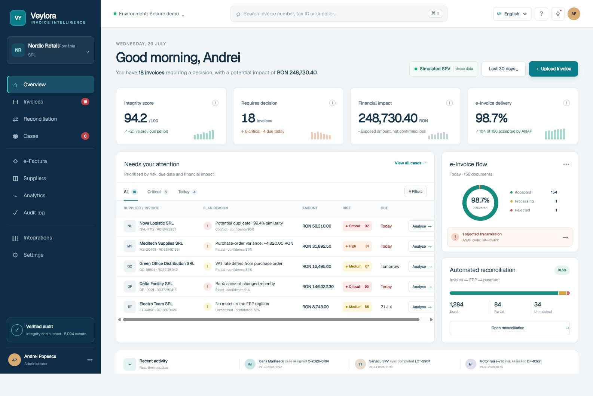
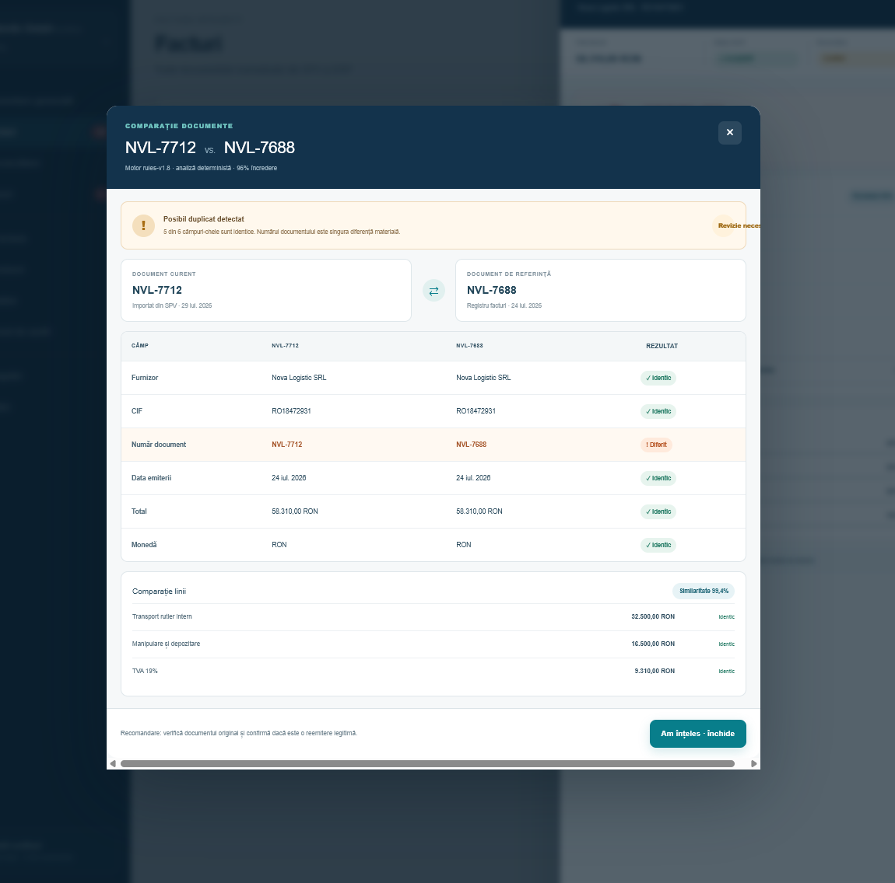

# Veylora Invoice Intelligence

**AI Invoice Integrity & E-Invoicing Reconciliation Platform** — an interactive, auditable, privacy-conscious demo for duplicate detection, invoice–ERP–payment reconciliation, and operational risk triage.

> Status: `1.0.0-demo.1`. This repository uses synthetic data only. ANAF/SPV, ERP, and banking connectors are simulated and do not send data to external systems.



## Why it exists

Finance teams operate across fragmented systems and manually investigate duplicate invoices, purchase-order discrepancies, and transmission failures. Veylora Invoice Intelligence provides a single decision queue with verifiable evidence, explainable scores, and human-in-the-loop controls.

## Demo capabilities

- responsive operational dashboard with a Romanian-language product interface;
- invoice registry, cases, suppliers, e-Invoicing, analytics, and integrations;
- deterministic reconciliation and explainable `rules-v1.8` risk scoring;
- side-by-side comparison for suspected duplicate invoices;
- local XML/CSV/JSON import with a 5 MB limit and anti-XXE protection;
- mandatory human verification before approving critical-risk invoices;
- SHA-256 audit events and CSV export protected against formula injection;
- unit tests, rendered-output tests, CI, CodeQL, and Dependabot.



## Quick start in VS Code

Requirements: Node.js 22 or newer and pnpm 10.

```bash
git clone <YOUR-REPOSITORY-URL>
cd ai-invoice-integrity-platform
corepack enable
pnpm install --frozen-lockfile
pnpm dev
```

Open `http://localhost:3000`. In VS Code, run the **Veylora Invoice Intelligence: development server** task or use the command above. The demo requires no accounts, API keys, or databases.

On Windows PowerShell, if script execution is restricted, use `pnpm.cmd` instead of `pnpm`.

## Quality gate

```bash
pnpm check
```

This command runs type-checking, linting, unit tests, a production build, rendered-output tests, and demo fixture verification. Each check can also be executed separately:

```bash
pnpm typecheck
pnpm lint
pnpm test:unit
pnpm test:render
pnpm verify:demo
pnpm audit --prod
```

## Architecture

```text
Browser / React UI
       │
       ├── typed synthetic data
       └── deterministic integrity engine
             ├── secure upload validation
             ├── explainable reconciliation and risk scoring
             ├── CSV export protection
             └── SHA-256 audit hashing
```

The demo is deliberately self-contained and keeps state in the browser. The target production architecture separates ingestion, normalization, reconciliation, case management, and append-only auditing through idempotent contracts and a transactional outbox. See [Architecture](docs/ARCHITECTURE.md), [Domain Model](docs/DOMAIN_MODEL.md), and the [primary ADR](docs/ADR/0001-modular-demo-architecture.md).

## Demo walkthrough

The complete 5–7 minute walkthrough is available in [docs/DEMO_GUIDE.md](docs/DEMO_GUIDE.md). The primary flow is:

1. Open the critical `NVL-7712` case.
2. Inspect the evidence and open the document comparison.
3. Close the comparison, confirm the human verification, and approve the invoice.
4. Upload a fixture from `samples/`.
5. Export the audit trail.

## Repository structure

```text
app/          application UI and layout
lib/          integrity engine and synthetic demo data
tests/        unit and rendered-build tests
samples/      synthetic invoice and ERP fixtures, including a negative fixture
docs/         architecture, privacy, AI governance, demo, and roadmap
.github/      CI, CodeQL, Dependabot, and collaboration templates
.vscode/      development tasks and editor recommendations
```

## Security, privacy, and responsible AI

- Do not upload real financial data or credentials to the demo.
- Risk scores assist operators; they do not make autonomous financial decisions.
- `confidence`, `risk`, and `severity` have distinct, documented meanings.
- To report a vulnerability, follow [SECURITY.md](SECURITY.md) instead of opening a public issue.
- See [AI Governance](docs/AI_GOVERNANCE.md) and [Privacy](docs/PRIVACY.md) for further details.

A production deployment requires organizational authentication, role-based authorization, secrets management, persistence, retention controls, a DPIA, live ANAF/ERP/banking contracts, observability, and resilience testing. These stages are described in the [roadmap](docs/ROADMAP.md).

## Demo and production boundary

This repository is a presentation-ready product demo, not a production financial system. All organizations, invoices, identifiers, scores, and integration results are synthetic. The interface labels simulated connectors explicitly and performs no external financial transactions.

## Contributing and license

See [CONTRIBUTING.md](CONTRIBUTING.md) and [CODE_OF_CONDUCT.md](CODE_OF_CONDUCT.md). The project is available under the [MIT License](LICENSE).
