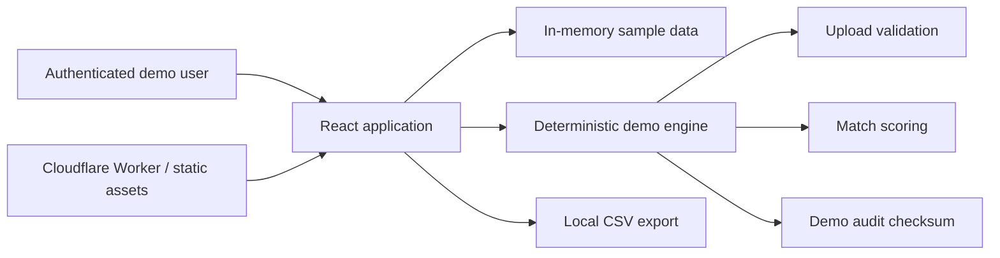
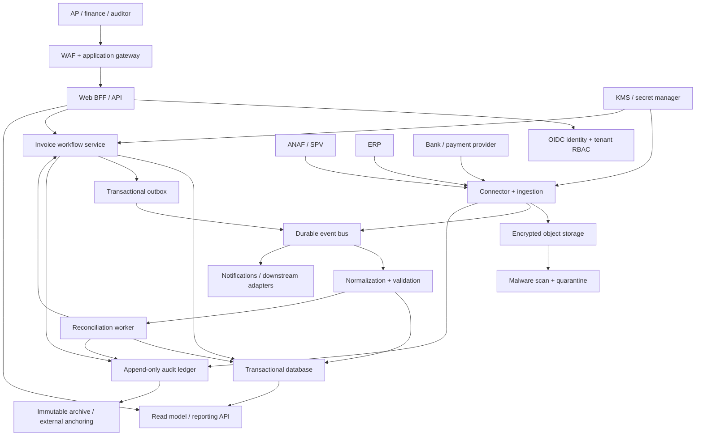

# Veylora Invoice Intelligence Architecture

## Purpose and trust boundary

Veylora Invoice Intelligence is a client-facing demonstration of an invoice integrity and e-Invoicing reconciliation platform. It explains how supplier invoices can be normalized, matched against ERP and payment records, prioritized for human review, and recorded in an auditable workflow.

This repository is a **functional demo, not a production financial system**. The current application uses in-memory sample data and performs interactions in the browser. It does not connect to ANAF/SPV, an ERP, a bank, an identity provider, or durable storage. No real or confidential documents should be uploaded to the hosted demo.

The architecture below separates what is implemented now from the production design so that a demonstration cannot be mistaken for a control on which payments may rely.

## Current demo architecture



| Concern | Demo implementation | Consequence |
| --- | --- | --- |
| Application | React/TypeScript rendered through vinext | Suitable for interactive product demonstrations |
| Data | Hard-coded records and component state | Refreshing the page resets decisions and imported records |
| Upload | Browser-side type, size, empty-file and basic anti-XXE checks | The file is not persisted or submitted to a server; validation is defense-in-depth only |
| Reconciliation | Deterministic scoring in `lib/invoice-engine.mjs` | Reproducible examples, not a complete accounting control |
| Audit | In-memory events chained with a deterministic 32-bit checksum | Useful to demonstrate sequencing; **not cryptographic evidence** |
| Integrations | Status cards and representative data | ANAF, ERP and banking connections are simulated |
| Authentication | Hosting access gate when deployed privately | No application-level tenancy, RBAC, provisioning or session policy |

The UI currently labels the proof as SHA-256, while the demo engine uses an FNV-1a-style 32-bit checksum. This is an intentional gap to resolve before any security or compliance claim: production must use the cryptographic scheme described below and the UI must report the actual algorithm and verification state.

## Production reference architecture

Production should retain a modular domain core while moving authority from the browser to authenticated server-side services.



### Component responsibilities

- **Web BFF/API:** validates sessions, tenant scope and commands; returns only fields authorized for the caller; issues correlation IDs.
- **Connector/ingestion:** polls or receives source records, records source identity and retrieval cursor, stores original bytes encrypted, verifies signatures where available, and emits an idempotent ingestion event.
- **Normalization/validation:** maps UBL/XML, ERP CSV/API payloads, and bank data into versioned canonical records. Parsing is isolated, schema constrained and network access disabled.
- **Reconciliation worker:** generates candidates, evaluates versioned deterministic rules, produces factors and classifications, and never approves a payment.
- **Workflow service:** owns cases, assignments, segregation-of-duties controls, comments, approvals and rejections. High-risk decisions require explicit human acknowledgement and, where policy requires, dual control.
- **Read model/reporting:** serves dashboards from projections; it is rebuildable and never the system of record.
- **Audit ledger:** persists security- and finance-relevant events append-only, with a per-tenant hash chain and immutable retention controls.
- **Outbox publisher:** publishes committed domain events at least once; consumers are idempotent and tolerate duplication or reordering.

## End-to-end flows

### 1. Document ingestion

1. A connector obtains a document and stable upstream identifier.
2. The service derives an idempotency key from tenant, source, upstream ID and source version (or cryptographic content digest when no stable ID exists).
3. Inside one transaction, it records the ingestion attempt, canonical metadata and an outbox event. Replays return the original result rather than duplicating an invoice.
4. Original bytes go to encrypted object storage in a quarantine state. Parsers run with resource limits, external entities and outbound network disabled.
5. Schema, signature, supplier identity, totals and currency are validated. Invalid records remain traceable and enter a review/dead-letter workflow.

### 2. Deterministic reconciliation

1. Candidate generation narrows ERP documents and payments by tenant, supplier identity, currency and configurable date/amount windows.
2. A versioned rule set computes exact, normalized and tolerance-based features.
3. Scoring uses integer points and money in minor units; no floating-point arithmetic participates in a financial decision.
4. The result contains the rule-set version, input references, feature values, score, classification and reason codes.
5. Automatic association is permitted only when policy thresholds, uniqueness and conflict checks pass. Otherwise a case is created for human review.

The demo formula produces a score from 0 to 10,000:

```text
score = document_exact (3,000)
      + party_exact (2,000)
      + amount_proximity (0..3,000)
      + date_proximity (0..1,000)
      + base evidence (500)
      + reference_similarity (0..500)
```

Different currencies are a conflict. Scores at or above 9,500 are `EXACT`, 7,500–9,499 are `PROBABLE`, and lower scores are `UNMATCHED`. Production policies must version thresholds and feature definitions; a single invoice/payment cannot be automatically assigned to conflicting matches.

### 3. Human decision and audit

1. The reviewer opens a case and receives the source documents, normalized fields, reason codes and rule version.
2. The API rechecks authorization, current entity version and segregation-of-duties policy when the decision is submitted.
3. The decision, case state change, audit event and outbox record commit atomically.
4. The client receives a durable decision ID. Retries with the same idempotency key return that decision.
5. Auditors can verify event hashes, document digests, actor identity, timestamps and policy/rule versions without relying on mutable dashboard projections.

## Audit integrity design

Each audit event must use a stable canonical serialization and include at least:

- event ID, tenant ID and aggregate ID/version;
- actor type and immutable actor ID (user, service or connector);
- action, outcome and reason code;
- UTC timestamp from the server and correlation/causation IDs;
- policy, normalization and rule-set versions;
- before/after references or field-level deltas, with sensitive values minimized;
- source-document digest and `previous_hash`.

The production event hash is:

```text
event_hash = HMAC-SHA-256(tenant_audit_key,
  canonical_event_without_hash || previous_hash)
```

Keys are versioned in KMS/HSM and inaccessible to the application database. Chains are partitioned predictably (for example by tenant and UTC month), with signed checkpoints anchored to immutable storage. Verification jobs continuously detect gaps, forks and digest mismatches. Hash chaining detects tampering; it does not replace access controls, database backups, time synchronization or legally appropriate retention.

## Delivery semantics: idempotency and outbox

Distributed delivery is assumed to be **at least once**. “Exactly once” is implemented as an observable business effect through deduplication, not as a transport promise.

- Command requests carry an `Idempotency-Key`, scoped by tenant, endpoint and authenticated principal. Store the request digest, response reference and expiry; reject reuse with a different payload.
- Connector events use a unique `(tenant_id, source_system, source_record_id, source_version)` key.
- Reconciliation runs use a unique `(tenant_id, invoice_id, input_revision, ruleset_version)` key.
- The outbox row is inserted in the same database transaction as the domain change. A relay leases unpublished rows, publishes them, then records publication. Crashes may cause a replay.
- Consumers maintain an inbox/deduplication record keyed by event ID and make the business update and inbox insert atomic.
- Event handlers tolerate out-of-order records by checking aggregate versions. Poison messages move to a dead-letter queue with an auditable replay action.

## Security and privacy controls for production

- Tenant isolation is enforced in every query and storage key, preferably with database row-level security as a second boundary.
- OIDC/OAuth 2.1, phishing-resistant MFA for privileged roles, short-lived sessions and server-side RBAC/ABAC are required.
- Original documents, normalized data and backups are encrypted with managed keys; secrets stay in a secret manager and are rotated.
- Logs exclude invoice contents, tokens, bank account details and personal identifiers by default. Diagnostic access is approved, time-bound and audited.
- Data minimization, purpose limitation, retention schedules, legal holds, export and erasure workflows are defined per data class. An audit record may retain a non-reversible digest after content deletion where law and policy permit.
- Uploads are size- and schema-limited, scanned, stored outside the web root, parsed in a sandbox and protected from XML entity expansion, formula injection and decompression bombs.
- Egress allowlists, signed webhook verification, replay windows and certificate/key rotation protect external connectors.

## Reliability and operations

Suggested initial service objectives for production, to be validated with clients:

| Capability | Target | Measurement |
| --- | --- | --- |
| Interactive API availability | 99.9% monthly | Successful authorized requests excluding client errors |
| Ingestion freshness | 99% within 15 minutes | Source timestamp to durable canonical record |
| Decision durability | RPO 0 for committed decisions | Transaction log and restore tests |
| Core recovery | RTO under 4 hours | Quarterly disaster-recovery exercise |
| Audit verification | 100% of active chains daily | Automated chain and checkpoint verification |

Use structured logs, metrics and traces joined by correlation ID, with dashboards for connector lag, reconciliation duration, unmatched rates, outbox age, dead letters and audit verification. Deploy with backward-compatible migrations, canary/rolling releases, feature flags for new rule sets, point-in-time recovery and documented rollback procedures.

## Explicit limitations

The repository does not currently provide durable persistence, real integrations, production authentication/authorization, tenant isolation, cryptographic audit evidence, malware scanning, electronic-signature validation, production-grade XML/UBL validation, job processing, observability or disaster recovery. Scores and financial data are illustrative. Production use requires threat modelling, privacy/legal review, penetration testing, connector certification, reconciliation validation against representative datasets, operational runbooks and an accountable human approval policy.

