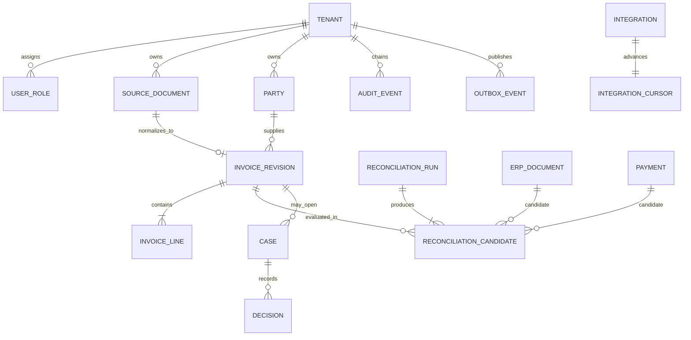
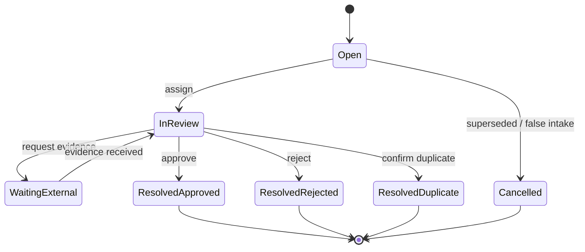

# Domain Model

## Modelling principles

- Every business record belongs to exactly one `Tenant`; tenant identity is explicit in persistence keys, messages and authorization checks.
- Money is stored as signed integer minor units plus ISO 4217 currency. Display formatting is never used for computation.
- Source payloads are immutable evidence. Corrections create a new revision linked to the prior record.
- Business decisions are server-authoritative, versioned and auditable. Derived dashboards are disposable projections.
- Reconciliation is deterministic for the same canonical inputs, configuration and rule-set version.
- External delivery is at least once; commands and consumers are idempotent.
- Timestamps are UTC instants. Local dates such as invoice issue dates remain explicit calendar dates with their source context.

## Core model

### Tenant and access

**Tenant** — legal/operational boundary. Fields: `id`, legal name, tax identifiers, locale, default currency, policy version, data residency, status, created time.

**Principal** — human or workload identity from the configured identity provider. Do not copy authentication secrets into the domain database.

**UserRole** — tenant-scoped assignment such as `viewer`, `reviewer`, `approver`, `auditor`, `integration_admin` or `tenant_admin`. Production policy may add amount limits, business units and segregation-of-duties constraints.

### Evidence and canonical invoices

**SourceDocument** — immutable envelope for bytes received from ANAF/SPV, ERP, upload or another source. Important fields:

- `id`, `tenant_id`, `source_system`, `source_record_id`, `source_version`;
- original filename/media type, byte length, encrypted object key;
- `content_sha256`, signature verification result and malware-scan state;
- received time, upstream creation time, parser version and processing state;
- lineage to a superseded document where applicable.

**InvoiceRevision** — canonical representation derived from one source document. Important fields:

- stable `invoice_id` plus monotonic `revision`;
- supplier/customer party references and normalized tax identifiers;
- document number, issue/due dates, type, currency;
- net, tax, gross and payable minor-unit amounts;
- e-Invoice identifiers/status, purchase-order references and bank-account token/reference;
- canonical schema version, validation status and validation reason codes;
- source document ID and creation time.

An invoice revision is immutable. A correction, cancellation or re-import creates another revision; the active revision is selected explicitly. Original text is not silently overwritten by normalized text.

**InvoiceLine** — stable line within a revision: source line ID, description, quantity in fixed-scale decimal, unit code, unit price minor units, net/tax/gross minor units, VAT category/rate, product/order references and normalized tokens used for comparison.

**Party** — supplier/customer identity within a tenant: legal name, normalized tax identifier, country, registry IDs and risk state. Bank details and contact data should be separated, encrypted and disclosed only to authorized roles.

### ERP, payment and integration records

**ERPDocument** — immutable revision of a purchase order, goods receipt, vendor invoice or accounting posting. Carries source IDs, party, currency, amount, dates and document references.

**Payment** — bank or ERP payment fact. Carries provider transaction ID, booking/value dates, amount/currency, counterparty reference and a tokenized account identifier. A payment association is not proof that a payment was authorized by this application.

**Integration** — tenant-scoped connector configuration, authorization status, capability set and secret reference. Secrets reside in a secret manager, not this entity.

**IntegrationCursor** — last durable upstream position and synchronization state. Cursor advancement is transactional with accepted ingestion records, or made replay-safe through upstream IDs.

### Reconciliation

**ReconciliationRun** — immutable execution record containing:

- `id`, tenant, trigger, start/end times and state;
- canonical input revision and candidate-set digest;
- `ruleset_version`, configuration version and engine build;
- idempotency key and correlation ID.

**ReconciliationCandidate** — comparison of an invoice revision with an ERP document and/or payment. Stores integer score `0..10000`, classification, feature vector, reason codes, amount/date deltas and conflict flags.

Recommended classifications:

- `EXACT`: high score, required identities match, no conflict and a unique winner;
- `PROBABLE`: plausible but requires policy-defined review;
- `UNMATCHED`: insufficient evidence;
- `CONFLICT`: hard invariant failed, for example currency mismatch or mutually exclusive assignment;
- `SUPERSEDED`: result no longer applies because an input revision or rule set changed.

Features are stored rather than reconstructed from a later rule version. Examples include exact source reference, normalized party/tax-ID match, currency match, amount delta in minor units, date delta in days, purchase-order coverage and line-token similarity in basis points.

### Cases and decisions

**Case** — review aggregate created for a duplicate suspicion, amount/tax variance, missing ERP record, bank-detail change, rejected e-Factura or other reason. Fields: state, severity, reason codes, invoice revision, owner, due time, optimistic-lock version and resolution.

Suggested state machine:

**Decision** — immutable command outcome attached to a case: decision type, actor, server timestamp, rationale, evidence references, policy/rule versions, acknowledgement flags, idempotency key and prior aggregate version. Editing creates a compensating decision, never an in-place update.

### Audit and messaging

**AuditEvent** — immutable, tenant-scoped security/business event. Fields: event ID, sequence/partition, aggregate ID/version, actor, action/outcome, UTC time, correlation and causation IDs, minimized delta/evidence references, algorithm/key version, previous hash and event hash.

**OutboxEvent** — durable domain event written with the aggregate transaction: event ID/type/version, aggregate ID/version, payload, headers, occurred time, publication attempts and published time. Consumers deduplicate by event ID.

**InboxReceipt** — consumer-specific record proving an event ID was applied. It is inserted atomically with the consumer's business change.

## Invariants

1. Tenant IDs on all associated records must match; cross-tenant foreign keys are invalid.
2. A source revision is unique by `(tenant, source system, source record ID, source version)`.
3. `net + tax = gross` and other accounting equations must hold within a documented rounding policy or produce a validation reason code.
4. Currency must match before an amount-based automatic match is possible.
5. An `EXACT` result must satisfy configured mandatory features, threshold and uniqueness; score alone is insufficient.
6. One ERP document/payment cannot be consumed by incompatible active matches beyond its allocatable amount.
7. A human decision targets a specific invoice/case version. Stale writes fail and require re-review.
8. Critical-risk approval requires required acknowledgements and policy-authorized roles. The actor cannot bypass segregation-of-duties rules.
9. Audit events are append-only. A new event references the previous event hash in its partition.
10. Domain change and outbox event commit in one transaction; publishing is never the source of truth.

## Idempotency keys

| Operation | Stable key | Duplicate behavior |
| --- | --- | --- |
| Source ingestion | tenant + source + upstream ID + upstream version | Return existing source document |
| Content-only upload | tenant + SHA-256 + declared source context | Return existing intake or create an explicitly linked revision per policy |
| Reconciliation | tenant + invoice revision + candidate digest + rule-set version | Return existing run/result |
| Human decision | tenant + principal + command route + client idempotency key | Return prior decision if request digest matches; reject mismatched reuse |
| Event consumption | consumer name + event ID | Acknowledge without repeating the business effect |

Idempotency records need an explicit retention policy longer than the maximum retry/replay window. Never derive a key only from mutable presentation fields such as a formatted invoice number.

## Data classification and retention

| Class | Examples | Handling |
| --- | --- | --- |
| Restricted | invoice bytes, bank/account data, access tokens | Field/object encryption, least privilege, no routine logs, approved retention |
| Confidential | normalized invoice lines, party identifiers, case comments | Tenant isolation, role-based disclosure, encrypted storage/backups |
| Internal | rule configuration, operational metrics | Authenticated access and change audit |
| Public | product documentation and synthetic demo data | Repository-safe after verification that data is synthetic |

Retention is policy- and jurisdiction-dependent. Purging source content must preserve enough non-reversible metadata to demonstrate a prior event only where legally permissible. Legal holds override routine deletion and are themselves audited.

## Demo mapping and boundaries

The demo's `Invoice` and `AuditEvent` TypeScript shapes are presentation models, not production persistence contracts. The current engine demonstrates integer money, deterministic match scoring, upload checks and a chained checksum. It does not implement the complete aggregates, state machine, storage constraints, cryptographic audit scheme or distributed-delivery records described here.

